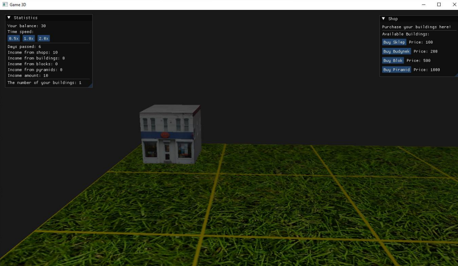

# Game3D (City Builder)

**Game3D** to projekt typu **city builder**, stworzony całkowicie w języku **C++** z użyciem **OpenGL, GLFW oraz ImGui**. W ramach projektu zaimplementowano własny mini-silnik graficzny, który obsługuje rendering, oświetlenie i interakcję z mapą.

## Funkcjonalności

- **Cykl dnia i nocy** – słońce porusza się wokół mapy, zmieniając oświetlenie sceny  
- **Mapa podzielona na kwadraty** – możliwość budowy na wybranych polach  
- **Różne typy budynków** – m.in. domki, piramida i inne obiekty  
- **System ekonomii** – kupowanie budynków przy użyciu prostego UI  

## Technologie

- **C++17**
- **OpenGL** – rendering 3D
- **GLFW** – obsługa okna i wejścia
- **ImGui** – interfejs użytkownika
- **Własny Engine** – renderowanie sceny i logika gry

## Dokumentacja

## Screenshots

